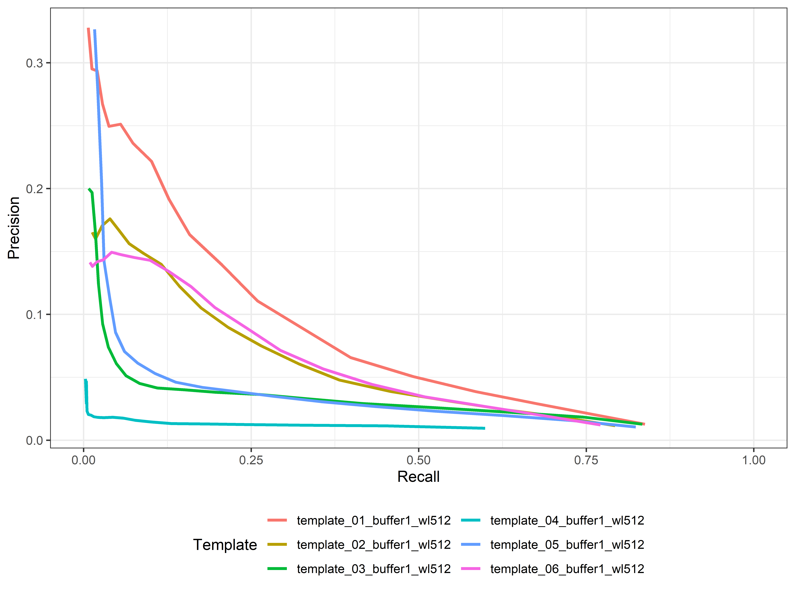
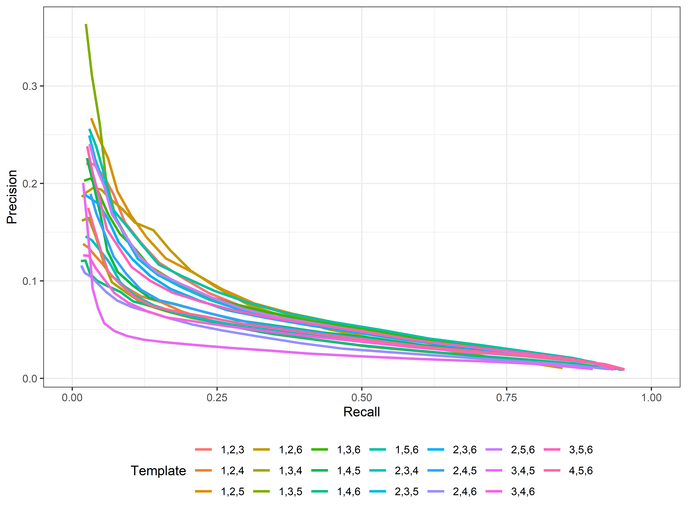

# calltemplates\_BTF

Scripts and analysis for call templates (monitoR) of the black-throated
finch. Using binary-point templates.

## To do

  - Run templates over following years data
  - Test CNN on template detections

## Results

### 2020 Road noise survey

Performance of individual templates at different cutoff values (2-20)

Performance of groups of 3 templates at different cutoff values (2-20)

